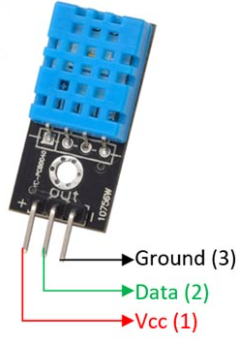

## Temperature and Humitdity

`ID`: DHT11



`Datasheet`: 
https://components101.com/sites/default/files/component_datasheet/DFR0067%20DHT11%20Datasheet.pdf


#### Program:

```python
#VCC -> 5v
#GND 
#Signal -> GPIO 4
import Adafruit_DHT as fruit
import time

DHT_SENSOR = fruit.DHT11
DHT_PIN = 4

while True:
    humid,temp = fruit.read(DHT_SENSOR,DHT_PIN)
    if humid is not None and temp not None:
        print(f"Humidity = {humid}, Temperature = {temp}") 
    else:
        print("Reading Not Found")
    time.sleep(2)
```

### References:

1. https://components101.com/sensors/dht11-temperature-sensor